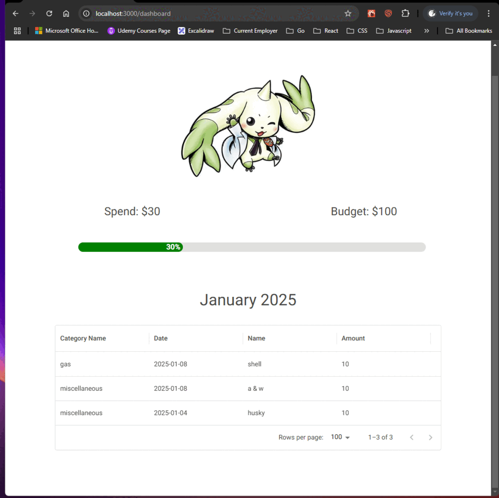

# My Budgety Admin Web Application



My Budgety Web Admin Application is for helping me manage my budget each month. With future updates to gamified the experience to make it more enjoyable. In addition, I use this project to learn the Nextjs framework.

## Dev Setup

### Setup pre-commit hooks

1.  Copy the file pre-commit.sample to .git/hooks/pre-commit
2.  Removed the .sample extension and deleted the pre-commit file in the .git/hooks folder

### Run application in dev mode

```bash
  npm run dev
```

### Build Docker Image

```bash
  docker build -t my-budgety-admin-web-app .
```

### Run Docker Container

```bash
  docker run -d -p 3000:3000 my-budgety-admin-web-app
```
