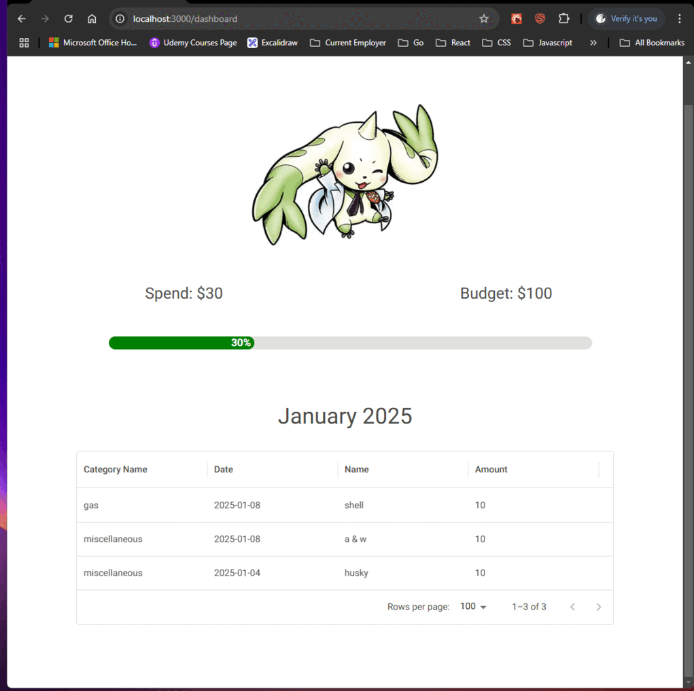
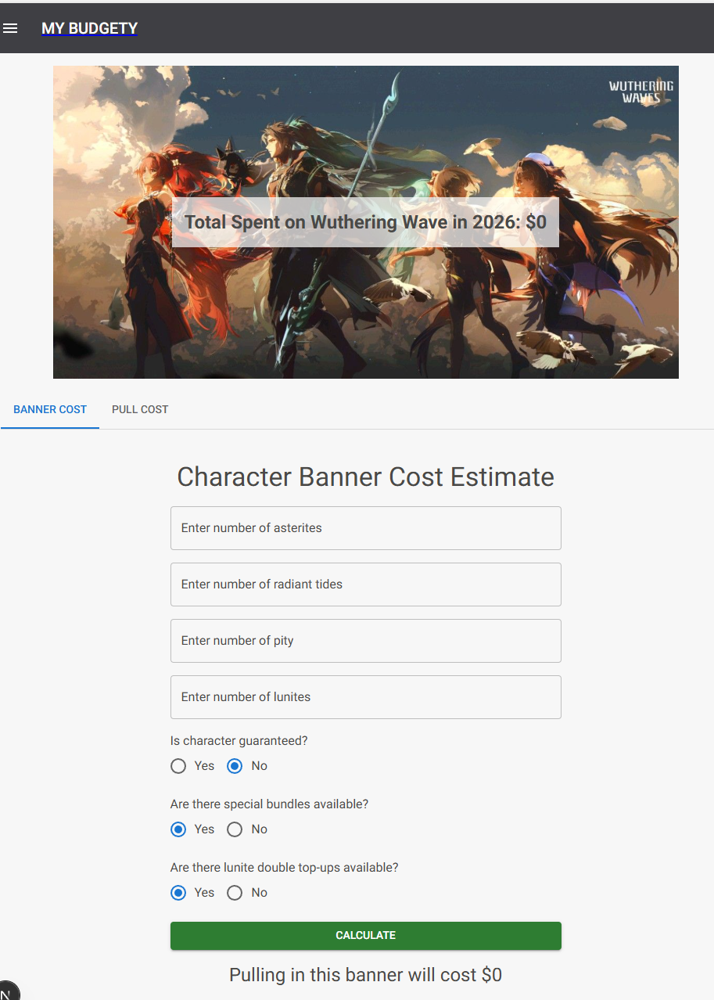

# My Budgety Admin Web Application



My Budgety Web Admin Application is for helping me manage my budget each month.
With future updates to gamified the experience to make it more enjoyable. In addition,
I use this project to learn the Nextjs framework.

## Features

Application tracked spending in gacha games I played (Love and Deepspace, Wuthering Wave)
and display it on the banner cost estimator.  I want to see how much I have already 
spent in each games and see the potential cost for getting the limited character
(account for the worst case which is I lost my 50/50 and have to go to hard pity). 



### Backend Repo that serve the application

[My Budgety API](https://github.com/wizgurl101/my-budgety-backend)
Developed using Nestjs and BigQuery as the database.

### CLI Tool

CLI Tool developed in Go using the Cobra package. Tool can remove duplicate entries
from previous credit card statement csv file from the latest csv. To address the problem
I was having when I download my credit card statement that contains previous expanse(s)
already uploaded from the last csv file.  Reduce my time having to use the web admin
expanse page to manually removed duplicate expanses.  Along with setting the 
month budget amount that yet to be implemented as a feature in the web admin.

[My Budgety CLI Tool](https://github.com/wizgurl101/my-budgety-cli)

## Dev Setup

### Setup pre-commit hooks

1.  Copy the file pre-commit.sample to .git/hooks/pre-commit
2.  Removed the .sample extension and deleted the pre-commit file in the .git/hooks folder

### Run application in dev mode

```bash
  npm run dev
```

### Build Docker Image

```bash
  docker build -t my-budgety-admin-web-app .
```

### Run Docker Container

```bash
  docker run -d -p 3000:3000 my-budgety-admin-web-app
```
